# Part 1 - Getting Started (Demo Project)

## Prerequisites

You should already have the latest version of Xcode or Android Studio installed (with the appropriate SDK). If not, download and install them now. Ensure you can start a new project, build, and deploy to your phone.

## Creating a new project

Install the [latest version of Unity](http://unity3d.com). During install choose (at minimum) to install Standard Assets and build support for your mobile platform (iOS or Android). After install, launch Unity. If you don't have an account, create one and log in. 

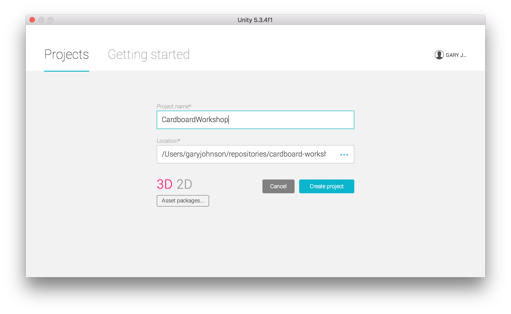

Create a new project. Name it whatever you want, choose which folder to save it in. For 2D/3D, select 3D. Click **Create Project**. You should eventually see the main Unity window with a new unsaved scene opened. We're going to ignore that for now and run a demo scene from the Google VR SDK to test everything out.

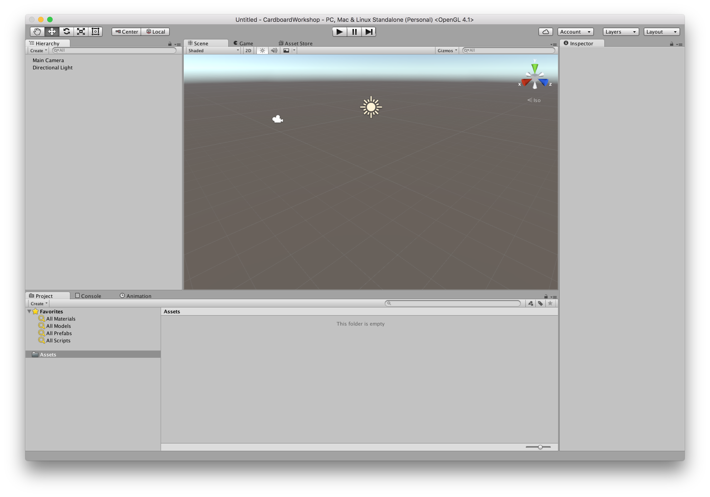

## Download Google VR SDK for Unity

You'll need to import the Google VR SDK for Unity. You can [download from here](https://developers.google.com/vr/unity/download) or run `git clone https://github.com/googlevr/gvr-unity-sdk.git`

Go back to Unity and click the **Assets** menu > **Import Package** > **Custom Package** and an open file dialog will appear. Navigate to the folder where you downloaded the Google VR SDK. In that folder, you should find a file called **GoogleVRForUnity.unitypackage**. Click on it and click **Import**.

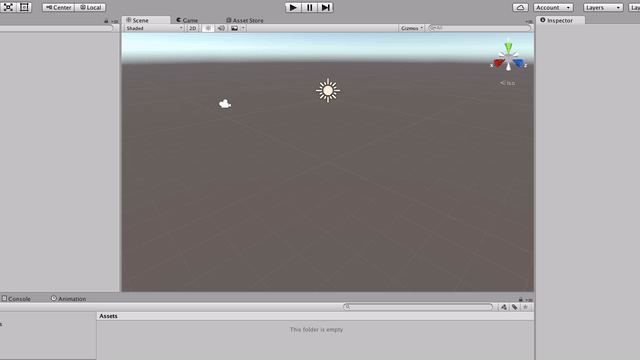

A dialog will open asking you what files you want to import. Select **All**, then **OK**.

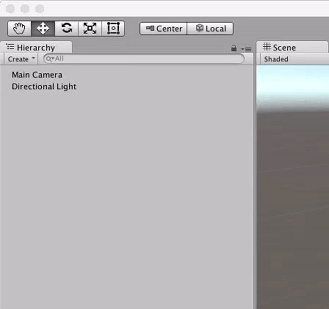

The assets you just imported are available in the **Project** pane, under the **GoogleVR** folder. Feel free to browse the folder and see what all got imported.

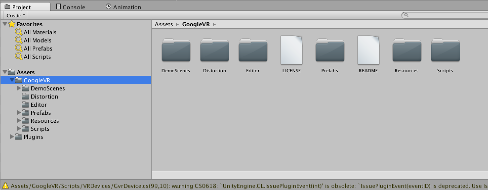

Now we are going to make sure we can build a Unity app and deploy to our phones. In the **Project** pane, open **Assets/GoogleVR/DemoScenes/HeadsetDemo/** and double-click on **DemoScene**. You should see the opened scene like this:

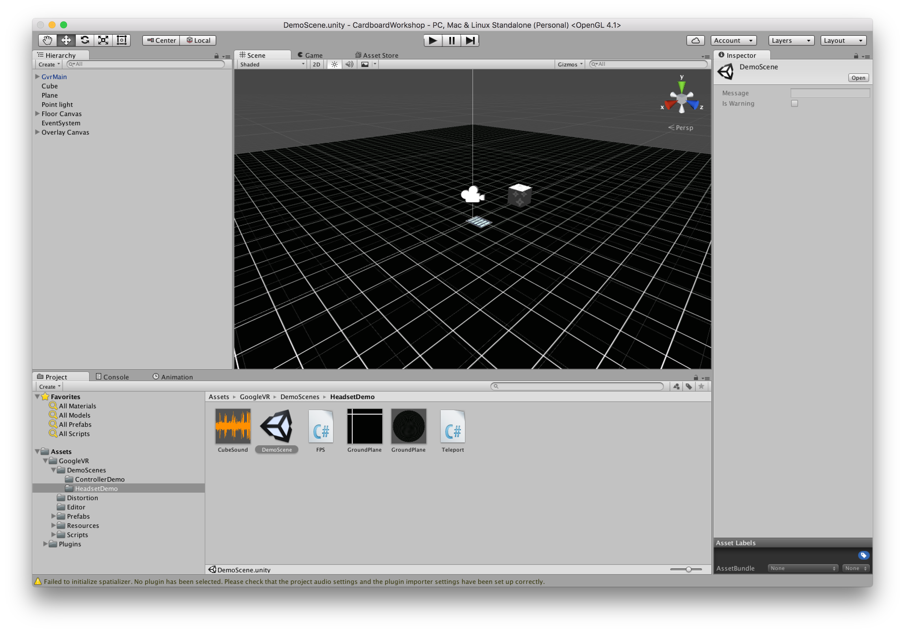

Unity operates primarily in scenes. Scenes can hold lots of things but it may help to think of them as if they were individual levels in a video game. A scene is basically an object graph that contains assets, scripts, and other objects that get instantiated at runtime with property values that you can adjust and save.

Unity has a powerful preview mode that allows you to run the active scene in the editor. Press the play button to start the scene. The Google VR SDK allows you to hold the **alt / option** key while moving your mouse to look around as if you were looking around in your Cardboard viewer.

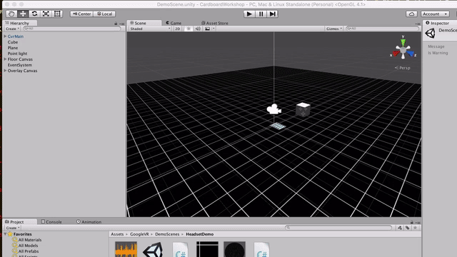

Now it's time to run this app on your phone. Press the play button again to leave preview mode. Plug your phone in to your computer. In Unity, click the **File** menu and click **Build Settings**. Select your desired mobile platform (iOS or Android) and click **Switch Platform**. Finally, you need to tell Unity which scenes to include in your build. Click **Add Open Scenes**. This should add DemoScene as the only scene in this list.

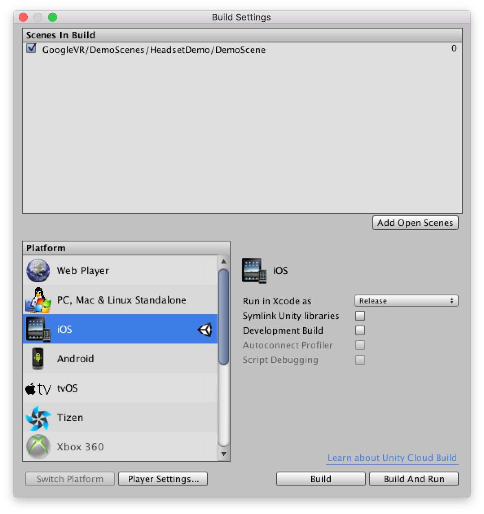

**NOTE**: Unity will use the first scene in the list as the scene that gets opened when the application starts. Here we only have one scene so it shouldn't matter for now.

### iOS Build and Run

A couple specific settings for iOS users -- if you're running Android, see the Android Build and Run section below. Click **Player Settings**. Under **Resolution and Presentation**, uncheck all Allowed Orientations except for **Landscape Left**.

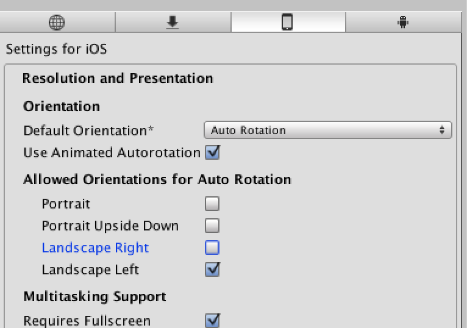

Finally, click **Build and Run**. You'll be asked where you want to store the generated project. Enter a name for the project folder and click **Save**. 

**NOTE**: During future builds of the project, you'll be asked to replace or append the exisitng project. Always hoose **append**.

Unity may only get as far as opening Xcode. If this happens, go to Xcode, choose **Open another project...** and navigate to the folder you just named eariler. Inside that folder should be a **Unity-iPhone.xcodeproj**. Select it and click **Open**.

### Android Build and Run

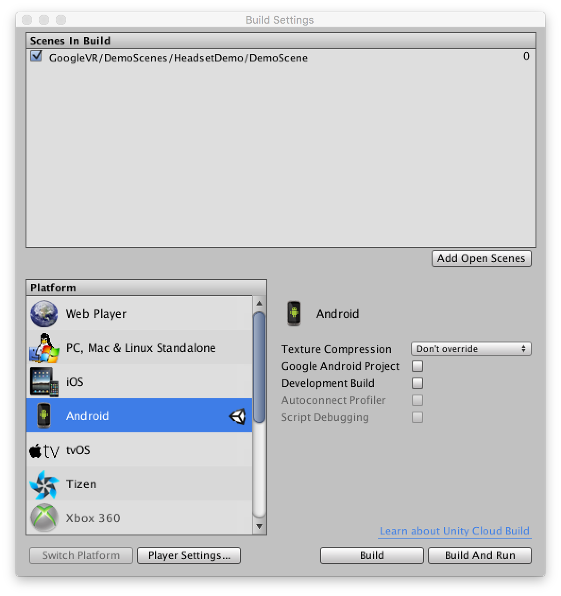

For Android you'll need to set a bundle identifier before building. A bundle ID is a unique ID used by Android to identify your applicaition. Click on **Player Settings** and update **Bundle Identifier**. It needs to be in the format of **com.<yourname>.<appname>**, with no whitespace, or special chars. (ex: com.makeonthelake.CardboardDemo)

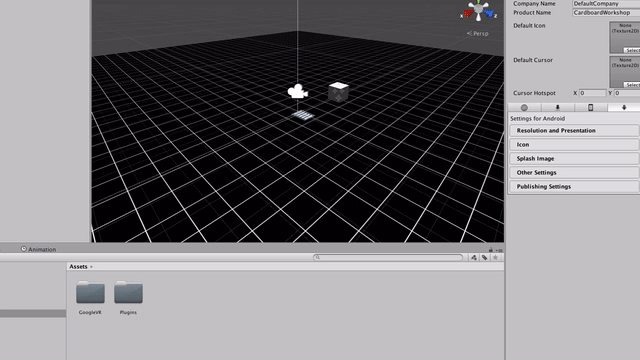

Click **Build and Run**. You'll be asked where you want to store the APK. An APK file is an executable for your Android device. Name the APK whatever you want and save it. An unlabelled open folder dialog will appear. 

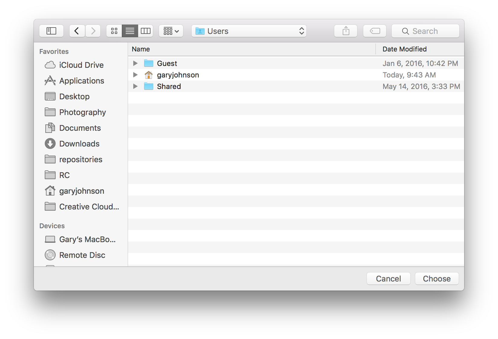

You'll need to select the Android SDK you installed. Here are where they are located by default:

* OSX: **~/Library/Android/sdk/**
* Windows: **C:\Users\%USERNAME%\AppData\Local\Android\android-sdk\**

Select the SDK folder and click **Choose**. If your Android device is plugged in, the app should begin running. 

## Try it out

Place your device in the cardboard and try it out. There is a single button on the Cardboard viewer. Look at a cube and press the button, and the cube will dissapear and a new one will appear randomly around you.

