# Part 2 - World Building

## Create a new scene

Now it's time to create a new scene from scratch. We are going to use Unity's terrain builder to create a world that we can look around in.

Click on the **Project** tab and under **Assets**, right-click and create a new folder called **MainScene**. We will hold all the resources for your new scene in this folder.

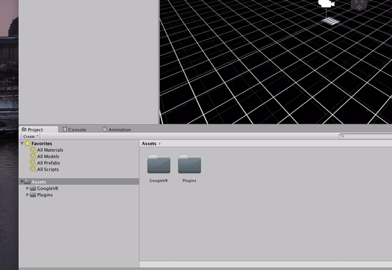

Inside the **MainScene** folder, right-click and create a new scene. Call it **MainScene**.

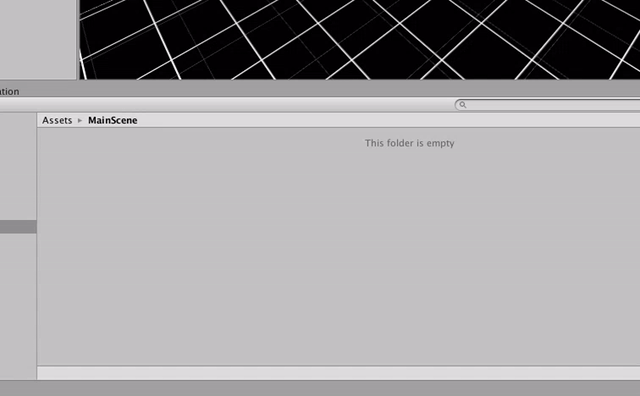

Double-click the scene you just created to open it. In your **Heirarchy** tab, you can see the current object graph for your scene. These are all the objects your scene contains. It should only contain two things off the bat -- **Main Camera** and **Directional Light**. 

In games, a camera determines what part of the 3D world you are looking at and how it is rendered. In a first person game, you are generally moving around the camera when you walk around the game world.

The lighting source is important because in this case everything would render black without it. 

## Build Terrain

It's time to create terrain that you can walk around in. In your **Heirarchy** tab, right-click and select **3D Object** -> **Terrain**.

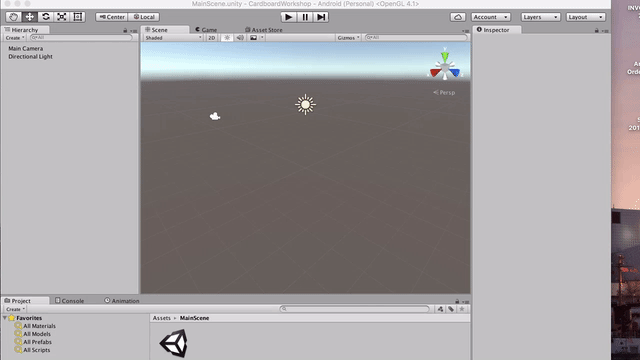

Now it's time to model some terrain. Select the newly-created terrain in the **Heirarchy** tab. Under the **Inspector** tab, click the **Raise / Lower Terrain** button. Now you can click and drag on the terrain in the scene to build up the terrain. (You can hold the **Shift** key while doing this to push the terrain back down).

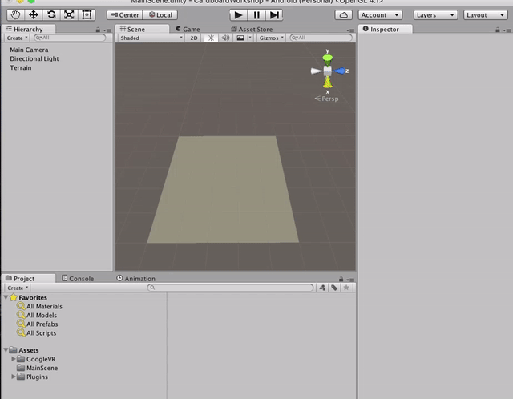

Let's keep your character from falling off the edge of the earth by creating an artifical barrier. Adjust brush and brush size and draw mountains around the edge of the terrain. By holding the mouse down longer and moving slower, you can build up the mountains pretty tall:

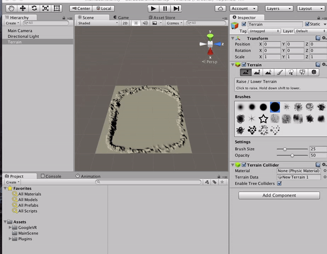

Keep the center flat for now. You'll need some space to navigate around in later and once you get a feel for how your character moves you can customize the center of the terrain.

## Navigating the scene

You can use the tools in the upper-left hand corner to navigate the scene. Click the pan tool (hand). Left-click and drag to pan around the scene. Right-click and drag to orbit around the scene, and use mouse wheel to zoom in and out:

## Painting the terrain

Your terrain is made but it's a flat gray color. Let's apply some texture. Navigate to [Yughues Free Ground Materials](https://www.assetstore.unity3d.com/en/#!/content/13001) and click **Open in Unity**. The page will open inside of Unity. Click **Download**. You may need to log into your Unity account to complete the download. When prompted select all and click **Import**.

Before we can paint our terrain we need to define some terrain textures. In the main scene, select the terrain and in the **Inspector** tab click the paintbrush icon, then click **Edit Textures** -> **Add Texture...**. The add terrain window will open. You will provide a texture and a [normal map for bump mapping](https://en.wikipedia.org/wiki/Normal_mapping).

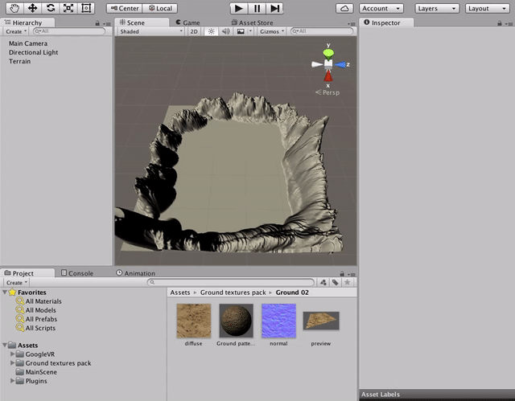

Leave this window open and under the **Project** tab, navigate to **Ground texture pack** -> **Ground 2**. Drag **diffuse** to the Add Terrain Texture window and drop in the first box. Then drag **normal** to the second box and click **Add**. Since this is the only terrain texture defined, it will be applied to the entire terrain.

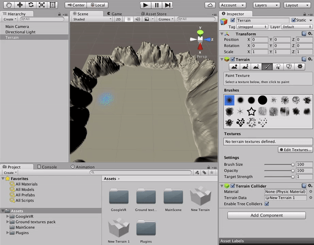

Add another terrain texture but use the **Grass & rocks** texture. Now let's use the grass & rocks texture and paint the center of our terrain to make it look different from the mountains. Select the paintbrush tool, select the texture, change the brush size to whatever you want, and start painting the center of your terrain:

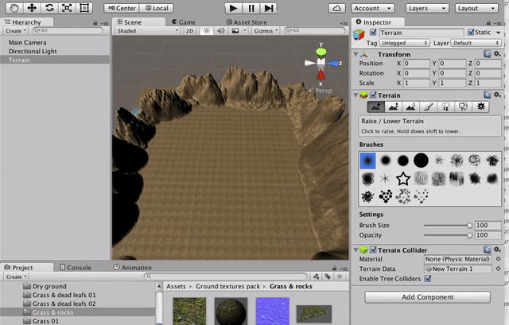

Press play. Your camera is placed outside of the terrain, so you'll see something like this:

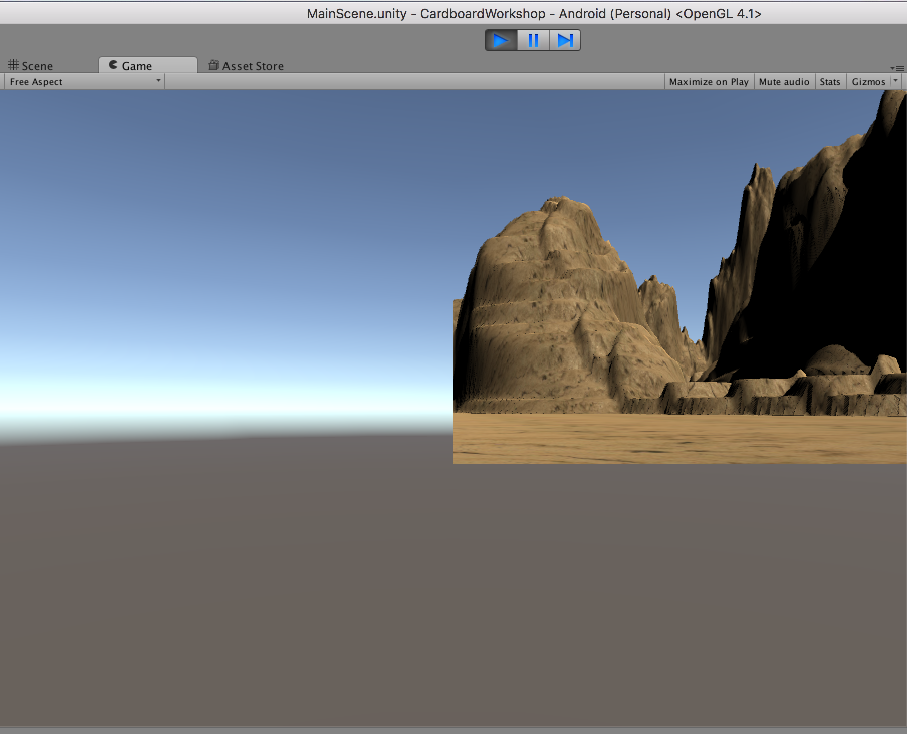

Let's get this working for Google Cardboard. Under the **Project** tab, navigate to **Assets** -> **GoogleVR** -> **Prefabs**. Drag **GVRManager** into the **Heirarchy** pane to add it to your scene.

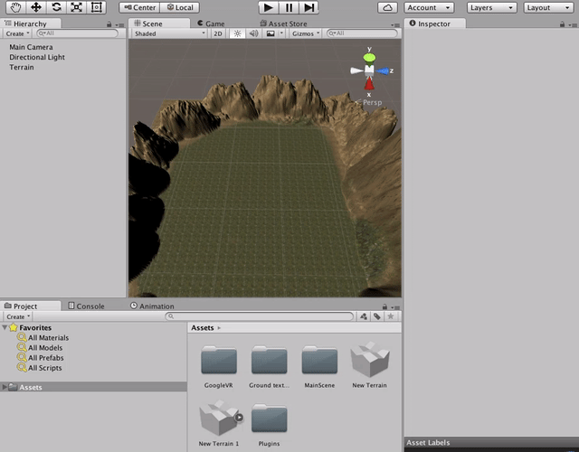

You need to update the **Main Camera** for Google VR. Select **Main Camera** in the **Heirarchy** tab, then under **Inspector**, click the tiny **Settings** icon under **Camera** and click **Update Stereo Cameras**. 

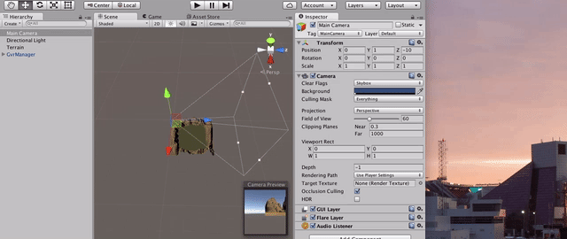

If you select **Main Camera** you should see in the scene markings that show you where the cameras are pointing (remember you have a camera for each eye now), the viewing angle, as well as a preview that shows you what the camera sees:

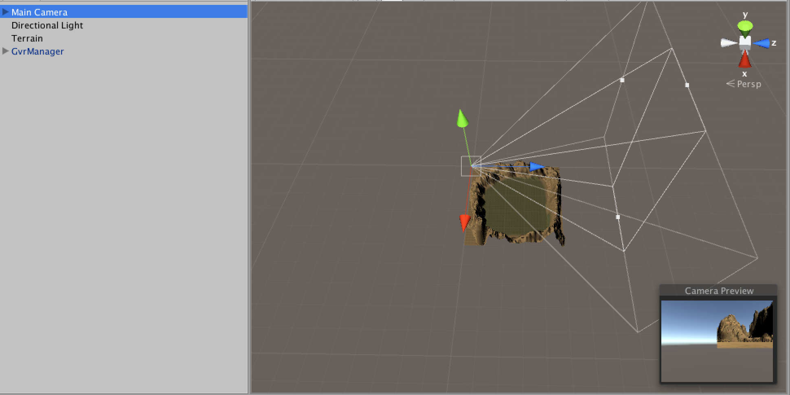

Press Play. You should be able to look around by holding **Alt** and moving your mouse:

Now let's make sure we can run this on your phone and use the Cardboard viewer. Press **Play** to exit the preview, and click **File** -> **Save Scene**. Then click **File** -> **Build Settings...**. You'll notice under **Scenes in Build** the old HeadsetDemo scene is listed but not your new one. Click **Add Open Scenes** to add your new scene, then select the HeadsetDemo scene and delete it. Finally, clcik **Build and Run**.

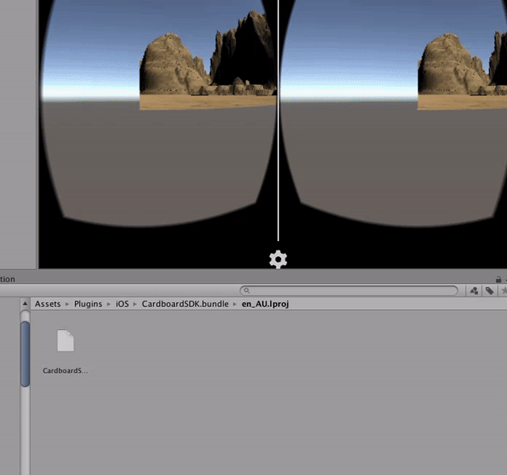

If you are building for iOS you may be asked where to save your project. Choose the same location as before **and choose to Append, not Replace**. Unity may open Xcode but not go any further. If so, just open the project called **Unity-iPhone** and click play. You should now be able to look around the game world on your device.

Let's do one last thing before moving on, and move the camera inside the world we built. Under the **Heirarchy** tab, select **Main Camera**. In the **Scene** tab, the camera should be highlighted with three arrows, one for each axis. Click and drag the arrows to move the camera center point to the inside of your terrain. Pull the top arrow up a little so it doesn't look like you're crawling on the ground (use the camera preview to eyeball a good height). Now you can press play and look around.

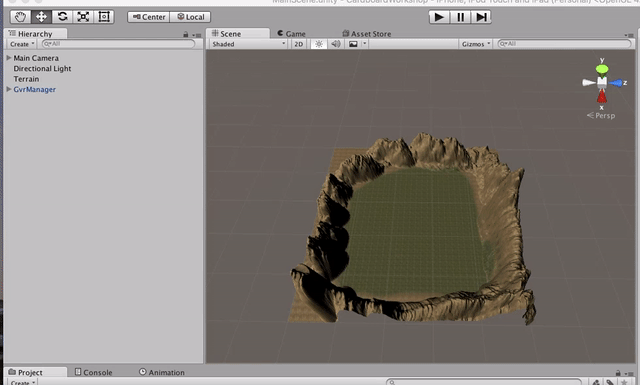

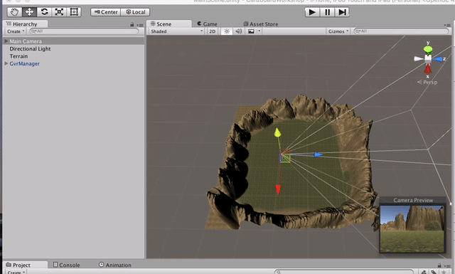
