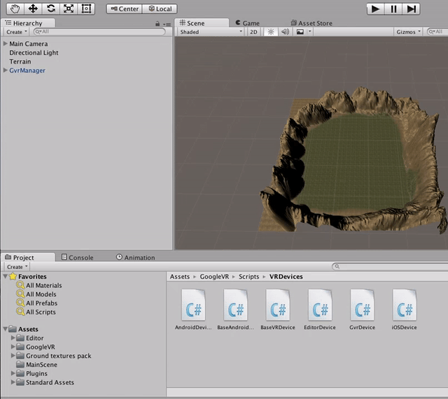
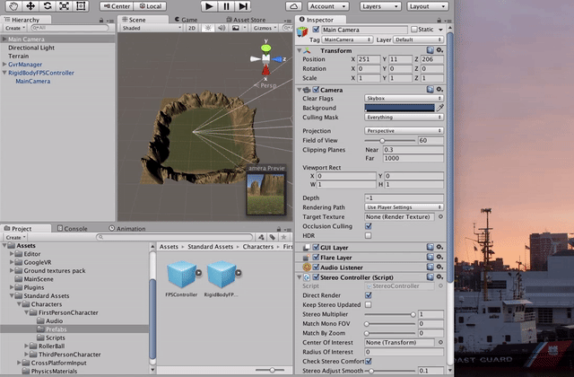
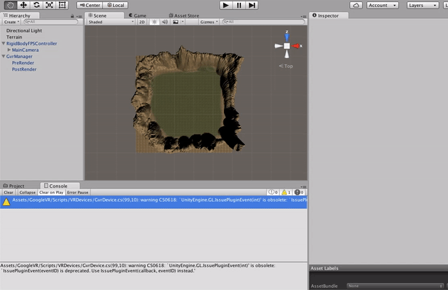

# Part 3 - Getting Around

## First Person Physics

We have a camera but it's just kind of floating around in space. If we start moving the camera it will pass through objects and not move up and down with the terrain.

We need the camera to act like an actual person with feet on the ground. Thankfully Unity has some prebuilt assets (*prefabs*) for implementing a first-person game that will allow us to do this with ease.

Click the **Assets** menu -> **Import Package** -> **Characters**. In the import dialog, click **All** and **Import**.

This will import into a folder called **Standard Assets**. In the **Project** tab, navigate to **Assets** -> **Standard Assets** -> **Characters** -> **FirstPersonCharacter** -> **Prefabs**. Select **RigidBodyFPSController** and drag it into the **Heirarchy** tab. 



Now we need to tie the FPS camera to our Google VR system. In the **Heirarchy** tab select **Main Camera** and delete it. Now expand **RigidBodyFPSController** and click the **MainCamera** underneath it. Click **Update Stereo Cameras**.



Finally, move the RigidBodyFPSController into the center of your terrain where the old MainCamera was. Click the **RigidBodyFPSController** and the move tool in the toolbar (two criss-crossed arrows). In the **Scene** tab drag the arrows on the FPS controller to move it to the center of the terrain.

Now we need to be able to move around. We'll do this by pressing down the button on the top of the cardboard, but we'll need to modify the **RigidbodyFirstPersonController.cs** script to do this, as it currently expects an analog stick input. In the **Project** tab, navigate to **Standard Assets** -> **Characters** -> **FirstPersonCharacter** -> **Scripts**. Double-click **RigidbodyFirstPersonController** to open it in the MonoDevelop IDE.

In the RigidbodyFirstPersonController.cs script, find the `GetInput()` method. It should look like this:

```csharp
private Vector2 GetInput()
{
    
    Vector2 input = new Vector2
        {
            x = CrossPlatformInputManager.GetAxis("Horizontal"),
            y = CrossPlatformInputManager.GetAxis("Vertical")
        };
    movementSettings.UpdateDesiredTargetSpeed(input);
    return input;
}
```

Let's start by just moving forward no matter what. Change the input variable so it just puts forward motion on the Y axis:

```csharp
private Vector2 GetInput()
{
    Vector2 input = new Vector2 (0, 1);
    movementSettings.UpdateDesiredTargetSpeed(input);
    return input;
}
```

Save the script (**File** -> **Save**) and go back to Unity. Unity should pick up the changes automatically. Press play and you should be moving forward automatically. You can look around (hold **Alt** and move the mouse) to change the direction you're walking:


Now let's only move around if the button on the Cardboard Viewer is held down. Re-open the RigidbodyFirstPersonController.cs script. At the top, under the class declaration, create a new field that determines if the controller is currently walking forward:

```csharp
...
[RequireComponent(typeof (CapsuleCollider))]
public class RigidbodyFirstPersonController : MonoBehaviour
{
    public bool IsMovingForward = false;

    [Serializable]
    public class MovementSettings
    {
...

```

Now navigate to the **GetInput()** method. Let's use the new field to determine how much we move forward:

```csharp
private Vector2 GetInput()
{
    int yMovement = IsMovingForward ? 1 : 0;
    Vector2 input = new Vector2 (0, yMovement);
    movementSettings.UpdateDesiredTargetSpeed(input);
    return input;
}
```

This will set yMovement to 1 if IsMovingForward is true, otherwise it will set it to 0. But we need something to change the `IsMovingForward` property, as right now it's always false.

Let's create a new script that will set IsMovingForward when we press the button. In the **Project** tab, navigate to **Assets** -> **MainScene**. Right-click in the folder and select **Create** -> **C# Script**. Name it **MoveOnButtonPressBehavior**.



Double-click on the script to open it in MonoDevelop. You should see some basic scaffolding:

```csharp
using UnityEngine;
using System.Collections;

public class MoveOnButtonPressBehavior : MonoBehaviour {

    // Use this for initialization
    void Start () {
    
    }
    
    // Update is called once per frame
    void Update () {
    
    }
}
```

We're going to attach this behavior to our FPS controller game object, then retrieve the RigidbodyFirstPersonController component from that game object. To understand more about game objects, components, and how they interact, [here is a good video about it](https://unity3d.com/learn/tutorials/topics/interface-essentials/game-objects-and-components). Change the behavior so it reads like so:

```csharp
using UnityEngine;
using System.Collections;
using UnityStandardAssets.Characters.FirstPerson;

public class MoveOnButtonPressBehavior : MonoBehaviour {

    void Start () {
        GvrViewer.Instance.OnTrigger += this.onTrigger;
    }

    void Update () {
    }

    void onTrigger() {
        var fpController = this.gameObject.GetComponent<RigidbodyFirstPersonController> ();
        fpController.IsMovingForward = !fpController.IsMovingForward;
    }
}
```

In the `Start()` method, we are telling our Google VR instance to call our `onTrigger()` method when the trigger is pressed.

In our new `onTrigger()` method, we are asking the object that the behavior is attached to (`this.gameObject`) for a component of type `RigidbodyFirstPersonController` (we're assuming it has one). Then we are toggling the `IsMovingForward` property we made earlier to the inverse of it's current value -- if it's true, it gets set to false, and vice-versa. 

We still haven't used the behavior yet. Go back to Unity and select **RigidBodyFPSController** in the **Heirarchy** tab. Scroll to the bottom of it's components in the **Inspector** tab, and drag your **MoveOnButtonPressBehavior** onto the bottom of the list. You should see it appear in the list of components.

Finally, press play. You should be able to look around by holding **Alt** and moving your mouse. When you left-click your mouse, you should start walking forward. Clicking again will stop you from moving.


By the way, now that you can move around, feel free to use the terrain editor to add some hills and dips to the center terrain. Keep the features shallow enough that you can still walk over them. Make sure you leave a flat, unraised area where the camera origin is. If you raise the terrain higher than your starting point, you'll fall through the earth when you start the game.

You may find that the terrain rises higher than you expect when using the brush tool. In the terrain editor, you can use the brush opacity so that it's not as dramatic. You can also use the smooth height tool to even things out.


