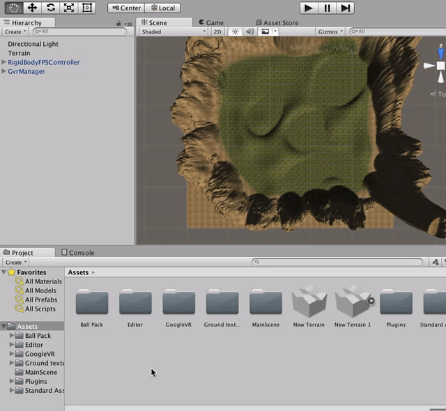
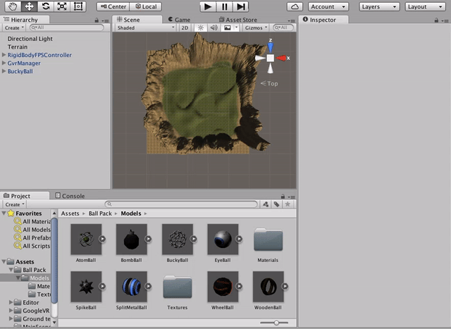
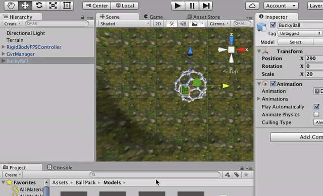
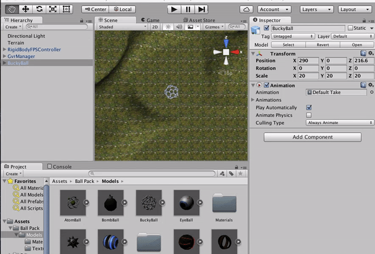
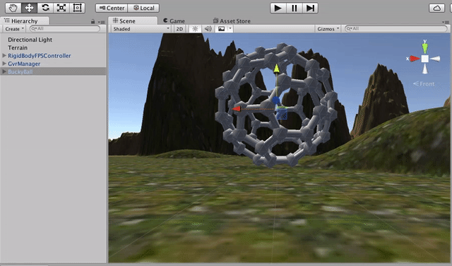
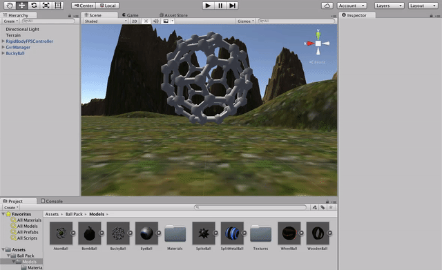
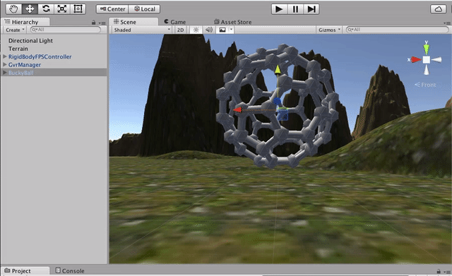
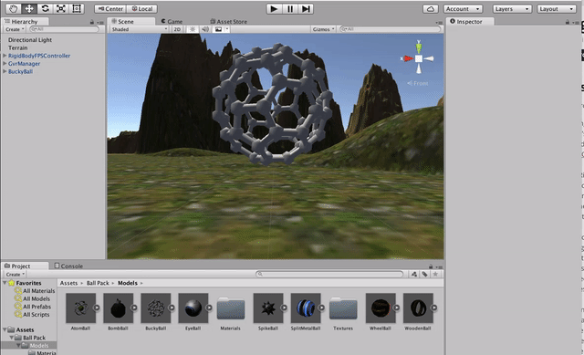
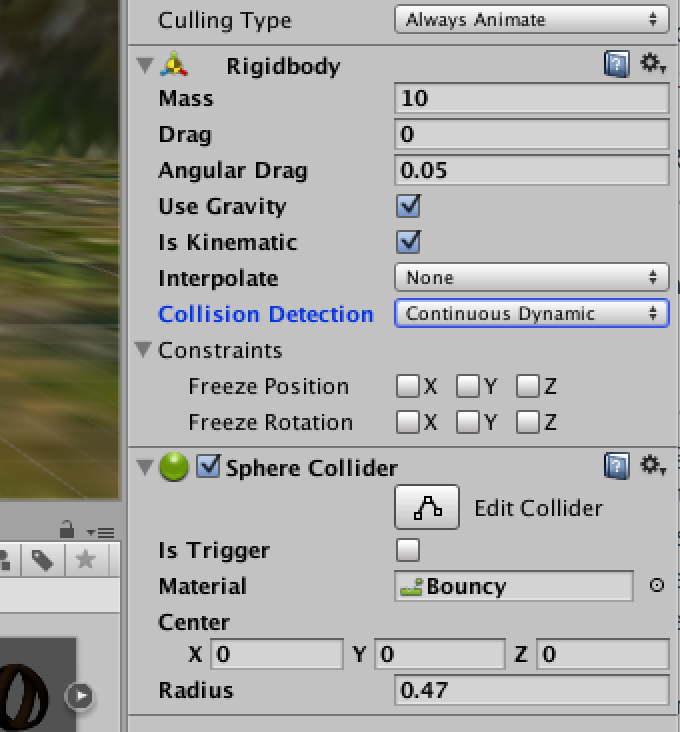

# Part 4 - Adding Interaction

## The Ball

To actually make this a game we're going to have to shoehorn in an objective. Let's start by dropping something else into the game world. Navigate to [Ball Pack on the Unity Store](http://u3d.as/1BU), download, and import into your project.

Now in the **Project** tab, open **Assets** -> **Ball Pack** -> **Models**. Drag the **BuckyBall** model into the **Heirarchy** tab. You can use the move tool in the toolbar to move the ball around. Use the handles to drag it into the center of the terrain:

We're going to knock this ball around like a giant beachball, so we need to increase the scale a bit. Select the BuckyBall in the **Heirarchy** tab. In the **Inspector** tab, change the X, Y, and Z scale to **20**. If you zoom in to the scene, you should be able to see the ball now:

Hit play. Depending where you placed it, you may need to look around for the ball. Whoops:

You need to use the move tool to lift the ball out of the ground. Navigate using the camera so you can see the side of the ball, then lift it up. Make sure it's fully above the ground, even if it's floating in the air a little:

Hit play again. Hm.

We imported a model into our scene but didn't do anything to cause it to respect the laws of physics. Let's do that next. We can attach behaviors to our object that will apply physics and collision detection. Select BuckyBall in the **Heirarchy** tab. Under **Inspector**, click **Add Component** and select **Physics** -> **Rigidbody**. The Rigidbody causes the attached game object to take part in the Unity physics engine, which includes things like gravity and collision.

Hit play again.

Almost there. We have gravity but Unity doesn't know how to handle collision detection. Collision detection is best done against simple shapes. Having collision detection work against the actual model would be incredibly CPU intensive. In this case, the general shape of the object is a sphere. Select the BuckyBall and click **Add Component** again. Select **Physics** -> **Sphere Collider**.

Note that by default, the sphere encompasses the size of the ball which means it's pretty much good to go. (The collider is drawn as bright-green lines in the scene). Let's tweak it just a little by changing the **Radius** from 0.5 to **0.47**, and the **Material** to **Bouncy**. Under the **Rigidbody** component, change **Collision Detection** to **Continuous Dynamic**. Your settings should look like this:

Press play again. Go ahead and walk right into the ball:

